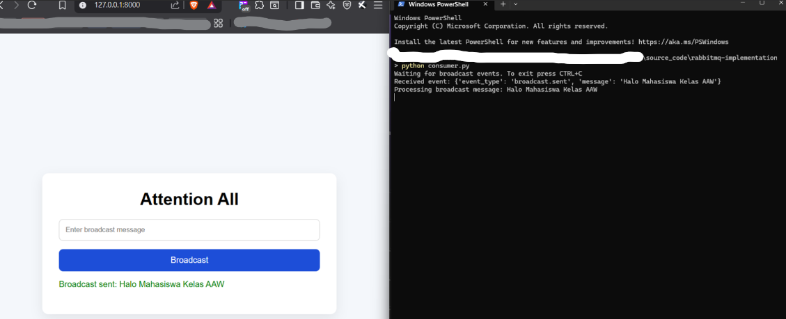
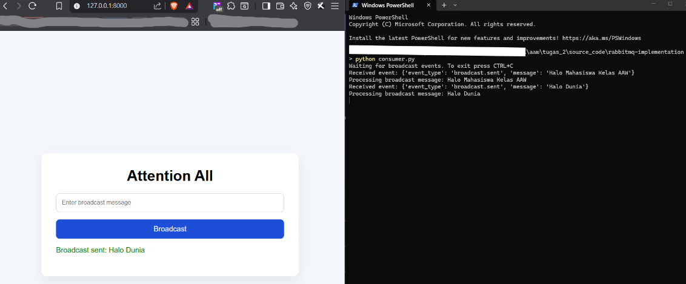

**Nama: Muhammad Faizi Ismady Supardjo**

**NPM: 2306244955**

# Assignment 2 AAW Workload Design

## Deskripsi
Project ini mengimplementasikan sistem event-driven sederhana menggunakan Django sebagai web interface dan RabbitMQ sebagai message broker. User dapat mengirim pesan broadcast melalui halaman web, lalu pesan tersebut dikirim sebagai event ke RabbitMQ dan diproses oleh consumer secara real-time.

## Tujuan Implementasi
Tujuan dari project ini adalah memenuhi requirement tugas workload design, yaitu:
- mengimplementasikan sistem event-driven sederhana menggunakan message broker
- membuat minimal satu producer dan satu consumer
- mendemonstrasikan pengiriman event, penyimpanan event dalam queue, dan pemrosesan event secara real-time
- menjelaskan mekanisme komunikasi asynchronous dan perbedaannya dengan request-response biasa

## Arsitektur Sistem
Sistem terdiri dari tiga komponen utama:
- Django sebagai frontend sederhana dan backend handler
- RabbitMQ sebagai message broker
- Consumer Python sebagai pemroses event

Alur komunikasi sistem:
1. User membuka halaman web Django
2. User mengisi pesan broadcast lalu menekan tombol `Broadcast`
3. Django menerima input tersebut dan bertindak sebagai producer
4. Producer mengirim event ke queue RabbitMQ
5. Consumer mendengarkan queue dan memproses event saat event masuk

## Struktur Repository

```text
/nama-repo-tugas
│
├── /rabbitmq-implementation
│   ├── manage.py
│   ├── consumer.py
│   ├── requirements.txt
│   ├── docker-compose.yml
│   ├── sample_event.json
│   │
│   ├── /core
│   └── /broadcast
│
└── README.md
```

## Teknologi yang Digunakan
- Python
- Django
- RabbitMQ
- Docker Compose

## Implementasi Producer
Producer diimplementasikan pada sisi Django, yaitu ketika user men-submit form broadcast. Data pesan dari form dikirim ke RabbitMQ sebagai event JSON.

Contoh event yang dikirim:

```json
{
  "event_type": "broadcast.sent",
  "message": "Attention all students, submission closes tonight."
}
```

## Implementasi Consumer
Consumer dijalankan sebagai proses terpisah menggunakan file `consumer.py`. Consumer mendengarkan queue RabbitMQ dan memproses pesan yang masuk secara real-time.

## Cara Menjalankan Aplikasi

### 1. Install dependency
Jalankan command berikut di folder `rabbitmq-implementation/`:

```powershell
pip install -r requirements.txt
```

### 2. Jalankan RabbitMQ
Jalankan command berikut di folder `rabbitmq-implementation/`:

```powershell
docker-compose up -d
```

RabbitMQ Management UI dapat diakses melalui:

```text
http://localhost:15672
```

Login default:

```text
username: <username_anda>
password: <password_anda>
```

### 3. Jalankan migration Django
Jalankan command berikut di folder `rabbitmq-implementation/`:

```powershell
python manage.py migrate
```

### 4. Jalankan consumer
Jalankan command berikut di folder `rabbitmq-implementation/`:

```powershell
python consumer.py
```

### 5. Jalankan server Django
Buka terminal baru, lalu jalankan command berikut di folder `rabbitmq-implementation/`:

```powershell
python manage.py runserver
```

Aplikasi dapat diakses melalui:

```text
http://127.0.0.1:8000
```

## Cara Pengujian
Pengujian dilakukan dengan langkah berikut:
1. Menjalankan RabbitMQ menggunakan Docker
2. Menjalankan consumer agar siap menerima event
3. Menjalankan aplikasi Django
4. Membuka halaman web pada browser
5. Mengisi pesan broadcast pada form
6. Menekan tombol `Broadcast`
7. Mengamati output pada terminal consumer dan queue pada RabbitMQ Management UI

## Hasil Pengujian

Setelah tombol `Broadcast` ditekan, event berhasil dikirim ke RabbitMQ queue dan diproses oleh consumer.

Contoh output pada terminal consumer:

```text
Waiting for broadcast events. To exit press CTRL+C
Received event: {'event_type': 'broadcast.sent', 'message': 'Attention all students, submission closes tonight.'}
Processing broadcast message: Attention all students, submission closes tonight.
```

Hal ini menunjukkan bahwa:
- producer berhasil mengirim event
- event masuk ke queue RabbitMQ
- consumer memproses event secara real-time

## Mekanisme Komunikasi Asynchronous
Pada implementasi ini, komunikasi berlangsung secara asynchronous. Producer tidak memproses pesan langsung sampai selesai, tetapi hanya mengirim event ke message broker. Setelah itu, consumer mengambil event dari queue dan memprosesnya secara terpisah.

Dengan mekanisme ini:
- producer dan consumer tidak harus berjalan dalam satu proses yang sama
- producer tidak perlu menunggu consumer selesai bekerja
- pemrosesan menjadi lebih fleksibel dan loosely coupled

## Perbedaan dengan Komunikasi Request-Response Biasa

### Request-response
- client mengirim request ke server
- server langsung memproses request
- client menunggu response dari server
- komunikasi berlangsung sinkron dalam satu alur

### Asynchronous event-driven
- producer mengirim event ke broker
- broker menyimpan event dalam queue
- consumer mengambil event saat siap
- producer tidak perlu menunggu hasil pemrosesan consumer

Pada request-response, pengirim dan pemroses saling bergantung secara langsung. Pada event-driven asynchronous, keduanya lebih terpisah sehingga sistem lebih scalable dan fleksibel.

## Asumsi dan Keputusan Implementasi
Beberapa asumsi dan keputusan implementasi dalam project ini:
- RabbitMQ dijalankan secara lokal menggunakan Docker
- sistem menggunakan satu queue bernama `broadcast_queue`
- frontend dibuat sederhana menggunakan Django template
- producer diintegrasikan ke dalam Django view
- consumer dijalankan sebagai proses terpisah

## Dokumentasi Tambahan yang Sebaiknya Disertakan
Agar dokumentasi lebih lengkap, sebaiknya tambahkan:
- screenshot halaman web broadcast
- screenshot terminal consumer
- screenshot RabbitMQ Management UI
- contoh beberapa pesan broadcast yang diuji

## Penggunaan Generative AI
Dalam pengerjaan tugas ini, saya **menggunakan** alat berbasis Generative AI untuk membantu:
- memahami integrasi Django dengan RabbitMQ
- merapikan dokumentasi README

Generative AI digunakan sebagai alat bantu pembelajaran dan percepatan implementasi, sedangkan proses integrasi, pengujian, dan penyesuaian akhir tetap dilakukan secara mandiri.

## Screenshot Hasil Pengujian

### Tampilan Aplikasi


