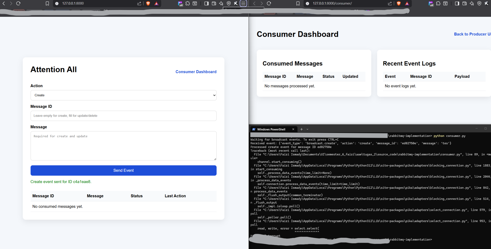
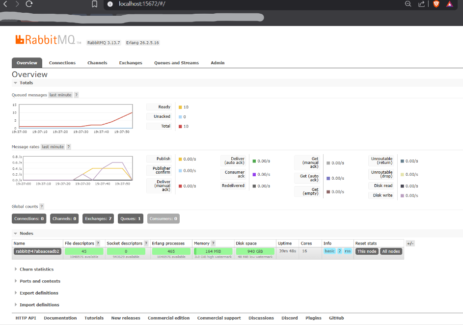
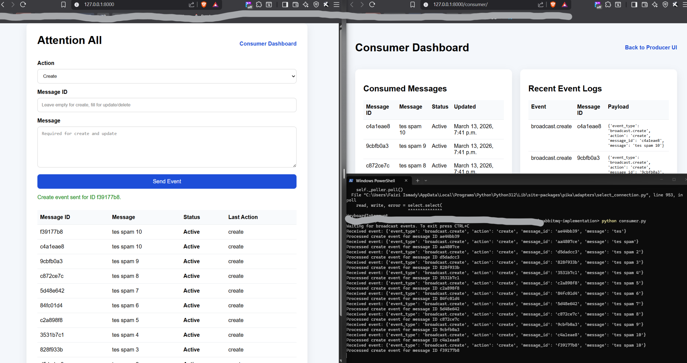
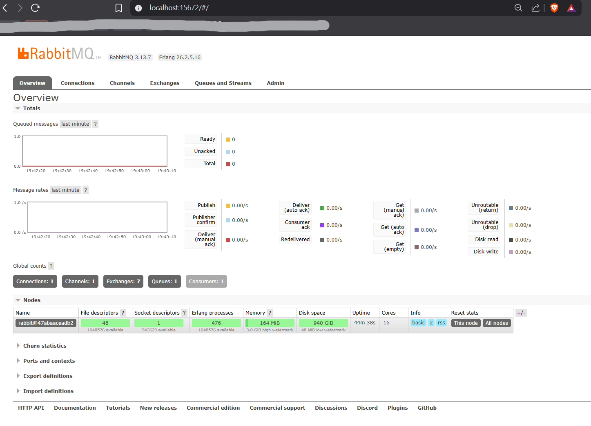
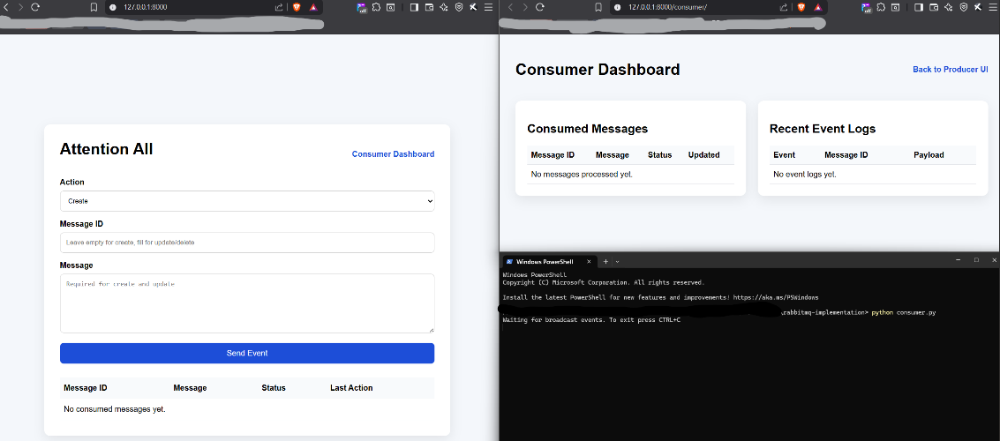
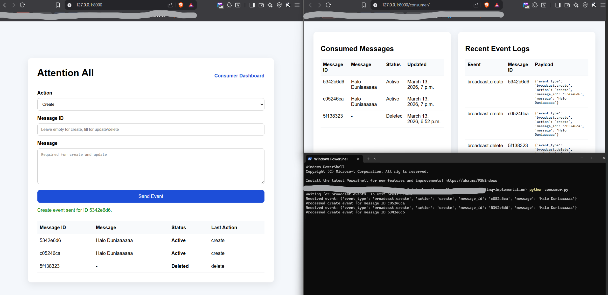
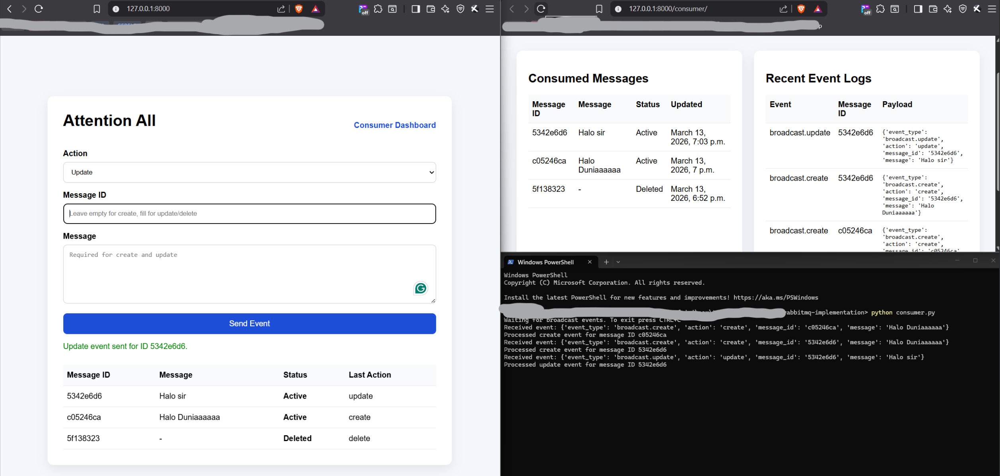
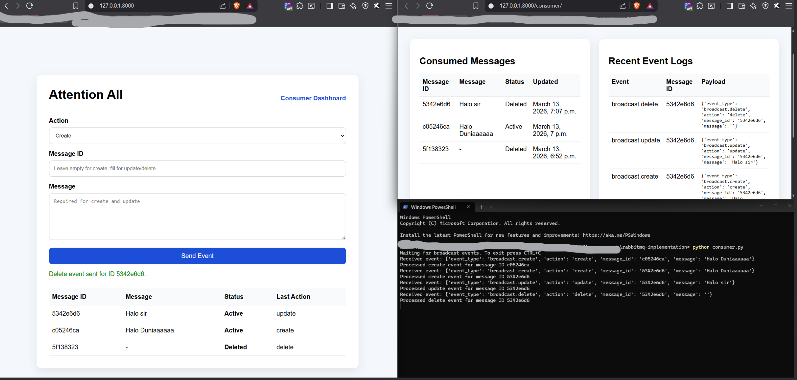

**Nama: Muhammad Faizi Ismady Supardjo**

**NPM: 2306244955**

# Assignment 2 AAW Workload Design

## Deskripsi
Project ini mengimplementasikan sistem event-driven sederhana menggunakan Django sebagai web interface dan RabbitMQ sebagai message broker. User dapat mengirim event broadcast melalui halaman web, lalu event tersebut dikirim ke RabbitMQ dan diproses oleh consumer secara real-time. Pada versi akhir implementasi ini, producer mendukung operasi create, update, dan delete terhadap message broadcast melalui mekanisme asynchronous berbasis message broker.

## Soal 1: Implementasikan sistem event-driven sederhana menggunakan Kafka atau RabbitMQ untuk mengirim dan memproses event antar komponen aplikasi

## Tujuan Implementasi
Tujuan dari project ini adalah memenuhi requirement tugas workload design, yaitu:
- mengimplementasikan sistem event-driven sederhana menggunakan message broker
- membuat minimal satu producer dan satu consumer
- mendemonstrasikan pengiriman event, penyimpanan event dalam queue, dan pemrosesan event secara real-time
- menjelaskan mekanisme komunikasi asynchronous dan perbedaannya dengan request-response biasa

## Arsitektur Sistem
Sistem terdiri dari tiga komponen utama:
- Django sebagai frontend sederhana dan backend handler
- RabbitMQ sebagai message broker
- Consumer Python sebagai pemroses event

Alur komunikasi sistem:
1. User membuka halaman web Django
2. User memilih action `create`, `update`, atau `delete`
3. User mengisi `message_id` dan/atau isi pesan sesuai kebutuhan aksi
4. Django menerima input tersebut dan bertindak sebagai producer
5. Producer mengirim event ke queue RabbitMQ
6. Consumer mendengarkan queue dan memproses event saat event masuk
7. Hasil pemrosesan consumer disimpan ke database Django dan ditampilkan pada consumer dashboard

## Struktur Repository

```text
/nama-repo-tugas
│
├── /rabbitmq-implementation
│   ├── manage.py
│   ├── consumer.py
│   ├── requirements.txt
│   ├── docker-compose.yml
│   ├── sample_event.json
│   │
│   ├── /core
│   └── /broadcast
│       ├── producer.py
│       ├── views.py
│       ├── models.py
│       ├── urls.py
│       ├── /migrations
│       └── /templates
│           └── /broadcast
│               ├── index.html
│               └── consumer.html
│
└── README.md
```

## Teknologi yang Digunakan
- Python
- Django
- RabbitMQ
- Docker Compose
- SQLite

## Soal 2: Buat minimal satu producer dan satu consumer yang saling berkomunikasi melalui message broker

## Implementasi Producer
Producer diimplementasikan pada sisi Django, yaitu ketika user men-submit form broadcast pada halaman utama. Producer tidak langsung memanipulasi data hasil akhir, tetapi mengirim event JSON ke RabbitMQ berdasarkan action yang dipilih user.

Action yang didukung:
- `create` untuk membuat message baru
- `update` untuk memperbarui message yang sudah ada
- `delete` untuk menandai message sebagai dihapus

Contoh event create yang dikirim:

```json
{
  "event_type": "broadcast.create",
  "action": "create",
  "message_id": "37d7c8aa",
  "message": "BABAYO"
}
```

Contoh event update yang dikirim:

```json
{
  "event_type": "broadcast.update",
  "action": "update",
  "message_id": "37d7c8aa",
  "message": "BABAYO versi update"
}
```

Contoh event delete yang dikirim:

```json
{
  "event_type": "broadcast.delete",
  "action": "delete",
  "message_id": "37d7c8aa",
  "message": ""
}
```

## Implementasi Consumer
Consumer dijalankan sebagai proses terpisah menggunakan file `consumer.py`. Consumer mendengarkan queue RabbitMQ dan memproses event yang masuk secara real-time.

Tugas consumer pada implementasi ini adalah:
- membaca event dari RabbitMQ queue
- memeriksa action yang dikirim oleh producer
- membuat atau memperbarui data message di database Django
- menandai data sebagai deleted untuk event delete
- menyimpan event log agar hasil konsumsi bisa ditampilkan di halaman consumer dashboard

Dengan pendekatan ini, consumer tidak hanya menampilkan log di terminal, tetapi juga memiliki UI di Django untuk memperlihatkan hasil pemrosesan event.

## Cara Menjalankan Aplikasi

### 1. Install dependency
Jalankan command berikut di folder `rabbitmq-implementation/`:

```powershell
pip install -r requirements.txt
```

### 2. Jalankan RabbitMQ
Jalankan command berikut di folder `rabbitmq-implementation/`:

```powershell
docker-compose up -d
```

RabbitMQ Management UI dapat diakses melalui:

```text
http://localhost:15672
```

Login default:

```text
username: guest
password: guest
```

### 3. Jalankan migration Django
Jalankan command berikut di folder `rabbitmq-implementation/`:

```powershell
python manage.py migrate
```

### 4. Jalankan consumer
Jalankan command berikut di folder `rabbitmq-implementation/`:

```powershell
python consumer.py
```

### 5. Jalankan server Django
Buka terminal baru, lalu jalankan command berikut di folder `rabbitmq-implementation/`:

```powershell
python manage.py runserver
```

Aplikasi dapat diakses melalui:

```text
http://127.0.0.1:8000
```

Producer UI:

```text
http://127.0.0.1:8000/
```

Consumer dashboard:

```text
http://127.0.0.1:8000/consumer/
```

## Soal 3: Demonstrasikan bagaimana event dikirim, disimpan dalam topic/queue, dan diproses oleh consumer secara real-time

[Lihat Screenshot Hasil Pengujian](#screenshot-hasil-pengujian)

## Cara Pengujian
Pengujian dilakukan dengan langkah berikut:
1. Menjalankan RabbitMQ menggunakan Docker
2. Menjalankan consumer agar siap menerima event
3. Menjalankan aplikasi Django
4. Membuka producer UI pada browser
5. Mengirim beberapa event dengan action `create`, `update`, dan `delete`
6. Mengamati output pada terminal consumer
7. Mengamati queue pada RabbitMQ Management UI
8. Membuka consumer dashboard untuk melihat hasil pemrosesan event

## Hasil Pengujian
Setelah tombol `Send Event` ditekan, event berhasil dikirim ke RabbitMQ queue dan diproses oleh consumer.

Contoh output pada terminal consumer:

```text
Waiting for broadcast events. To exit press CTRL+C
Received event: {'event_type': 'broadcast.create', 'action': 'create', 'message_id': 'c05246ca', 'message': 'Halo Duniaaaaaa'}
Processed create event for message ID c05246ca
Received event: {'event_type': 'broadcast.create', 'action': 'create', 'message_id': '5342e6d6', 'message': 'Halo Duniaaaaaa'}
Processed create event for message ID 5342e6d6
Received event: {'event_type': 'broadcast.update', 'action': 'update', 'message_id': '5342e6d6', 'message': 'Halo sir'}
Processed update event for message ID 5342e6d6
Received event: {'event_type': 'broadcast.delete', 'action': 'delete', 'message_id': '5342e6d6', 'message': ''}
```

Hal ini menunjukkan bahwa:
- producer berhasil mengirim event ke RabbitMQ
- event masuk ke queue `broadcast_queue`
- consumer memproses event secara real-time
- state message hasil konsumsi dapat dilihat kembali di consumer dashboard

## UI Producer dan UI Consumer
Implementasi ini memiliki dua halaman utama pada Django:

### Producer UI
Halaman utama digunakan untuk mengirim event ke RabbitMQ. User dapat:
- memilih action `create`, `update`, atau `delete`
- mengisi `message_id`
- mengisi isi pesan untuk action `create` dan `update`
- mengirim event melalui tombol `Send Event`

### Consumer Dashboard
Halaman consumer dashboard digunakan untuk melihat hasil pemrosesan event oleh consumer. Dashboard ini menampilkan:
- daftar message yang sudah diproses
- status message apakah masih aktif atau sudah deleted
- last action dari masing-masing message
- daftar event log terbaru yang telah dikonsumsi

Dengan adanya halaman ini, proses consumer tidak hanya terlihat dari terminal, tetapi juga dapat divisualisasikan langsung pada web interface Django.

## Soal 4: Lakukan pengujian dengan mengirim beberapa event dan jelaskan bagaimana mekanisme komunikasi asynchronous tersebut bekerja serta apa perbedaannya dengan komunikasi request-response biasa

[Lihat Screenshot Hasil Pengujian](#screenshot-hasil-pengujian)

## Pengujian








## Pengujian yang Dilakukan
Pengujian dilakukan dengan mengirim beberapa event melalui producer UI Django. Pada implementasi ini, event yang diuji mencakup operasi `create`.

Rangkaian pengujian yang dilakukan:
Mengirim beberapa event create tambahan untuk melihat bagaimana queue menyimpan beberapa message sebelum diproses

Pada saat consumer dimatikan sementara, event yang dikirim producer tetap masuk ke RabbitMQ dan dapat terlihat pada queue `broadcast_queue`. Setelah consumer dijalankan kembali, event-event tersebut diproses satu per satu secara berurutan. Hasil pemrosesan dapat dilihat melalui:
- terminal consumer
- RabbitMQ Management UI
- consumer dashboard pada Django

Berdasarkan pengujian tersebut, dapat dilihat bahwa RabbitMQ benar-benar berfungsi sebagai perantara antara producer dan consumer. Producer tidak berkomunikasi langsung dengan consumer, melainkan mengirim event ke queue terlebih dahulu.

## Mekanisme Komunikasi Asynchronous
Pada implementasi ini, komunikasi berlangsung secara asynchronous. Artinya, setelah user menekan tombol `Send Event` pada halaman Django, producer hanya bertugas mengirim event ke RabbitMQ dan tidak perlu menunggu sampai consumer selesai memproses event tersebut.

Alur asynchronous pada sistem ini adalah sebagai berikut:
1. User mengirim request dari halaman Django
2. Django sebagai producer membuat event berdasarkan action yang dipilih
3. Event dikirim ke RabbitMQ queue `broadcast_queue`
4. RabbitMQ menyimpan event tersebut di queue
5. Consumer mengambil event dari queue saat consumer aktif dan siap memprosesnya
6. Consumer memproses event dan menyimpan hasilnya ke database Django
7. Hasil pemrosesan dapat ditampilkan kembali pada consumer dashboard

Dari pengujian yang dilakukan, terlihat bahwa producer dan consumer tidak harus berjalan pada waktu yang sama. Producer tetap bisa mengirim event walaupun consumer sedang dimatikan. Event tersebut akan tetap berada di queue sampai consumer aktif kembali untuk memprosesnya. Inilah inti dari komunikasi asynchronous.

## Perbedaan dengan Komunikasi Request-Response Biasa

### Request-response
- client mengirim request ke server
- server langsung memproses request
- client menunggu response dari server
- komunikasi berlangsung sinkron dalam satu alur
- perubahan data biasanya dilakukan langsung oleh handler request

### Asynchronous event-driven
- producer mengirim event ke broker
- broker menyimpan event dalam queue
- consumer mengambil event saat siap
- producer tidak perlu menunggu hasil pemrosesan consumer
- pemrosesan akhir dapat dilakukan oleh komponen yang berbeda dari pengirim

Pada request-response, pengirim dan pemroses saling bergantung secara langsung. Pada event-driven asynchronous, keduanya lebih terpisah sehingga sistem lebih scalable, lebih fleksibel, dan lebih mudah dikembangkan ke banyak consumer jika dibutuhkan.

## Asumsi dan Keputusan Implementasi
Beberapa asumsi dan keputusan implementasi dalam project ini:
- RabbitMQ dijalankan secara lokal menggunakan Docker
- sistem menggunakan satu queue bernama `broadcast_queue`
- frontend (hanya tambahan) dibuat sederhana menggunakan Django template
- producer (hanya tambahan) diintegrasikan ke dalam Django view
- consumer dijalankan sebagai proses terpisah
- hasil pemrosesan consumer disimpan ke database SQLite agar dapat ditampilkan di dashboard
- koneksi RabbitMQ dikonfigurasi eksplisit menggunakan host 127.0.0.1, port 5672, virtual host /, dan kredensial default guest/guest agar producer dan consumer terhubung ke broker yang sama secara konsisten.

## Penggunaan Generative AI
Dalam pengerjaan tugas ini, saya menggunakan alat berbasis Generative AI untuk membantu:
- memahami integrasi Django dengan RabbitMQ
- merancang alur producer-consumer berbasis event
- merapikan dokumentasi README

Generative AI digunakan sebagai alat bantu pembelajaran dan percepatan implementasi, sedangkan proses integrasi, pengujian, dan penyesuaian akhir tetap dilakukan secara mandiri.

## Screenshot Hasil Pengujian

### Pre condition

- Sudah run docker image
- Sudah run django

### Awal UI dan isi consumer.py


### Create Message


### Update Message


### Delete Message



